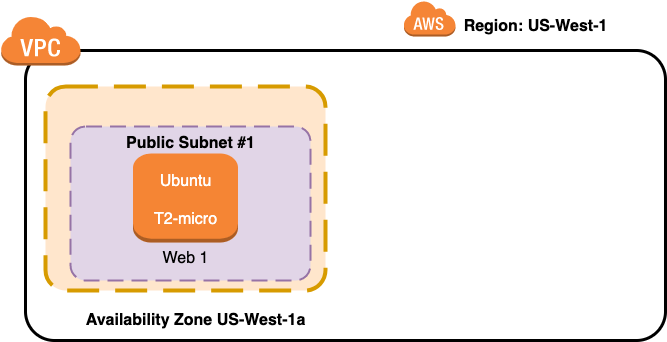

# Creating a New VPC

## With One Public Subnet and One Web Server

The Web server starts out as a simple "Hello World"



------

## Requirements 

[Install AWS CLI](https://docs.aws.amazon.com/cli/latest/userguide/cli-chap-install.html)

[Configure AWS CLI](https://docs.aws.amazon.com/cli/latest/userguide/cli-chap-configure.html)

[Install Terraform](https://learn.hashicorp.com/tutorials/terraform/install-cli)

```
Note:  You don't have to install these requirements into your desktop.  It is certainly quite feasible to use a virtual desktop for your development environment using tools like Oracle's virtualbox or VMware Workstation or Player, or Mac Fusion or Mac Parallels.  Perhaps an AWS Workspace or AWS Cloud 9 environments.
```

## Configuration

`Note: The variables do not have to be changed if you are ok with running a new VPC and Web server out of US-West-1 region`

Once the requirements are installed clone this repository and edit the file variables.tf

*  Edit the variable for your choice of AWS Region (currently, the default is "us-west-1".
*  Edit the CIDR blocks if you want to use different address range for your new VPC
*  Edit the Instance type if you want to use a different instance type (note t2.micro is the only one you can use for free tier)

## Launching the VPC and Web Server
After installing the requesite software and configuration of variables.

Run the following commands in terminal

* Terraform init (Causes terraform to install the necessary provider modules, in this case to support AWS provisioning)
* terraform validate (Validates the AWS provisioning code)
* Terraform Apply (Performs the AWS provisioning of VPC and Web Server)

After Terraform finishes provisioning the new VPC, Security Group and Web Server, it will output the Public IP address of the new public server in the terminal Window

------

#### Open a browser and you should see the welcome to nginx as shown below:


------

## Clean up

Once you have finished with this example run:

* Terraform Destroy (to remove VPC and Web Server)